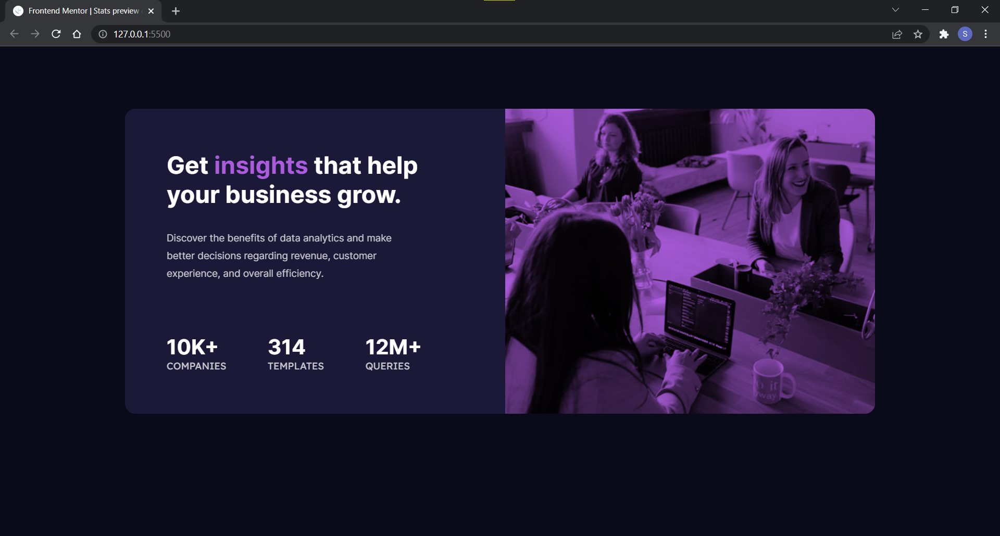

# Frontend Mentor - Stats preview card component solution

This is a solution to the [Stats preview card component challenge on Frontend Mentor](https://www.frontendmentor.io/challenges/stats-preview-card-component-8JqbgoU62). Frontend Mentor challenges help you improve your coding skills by building realistic projects. 

## Table of contents

- [Overview](#overview)
  - [The challenge](#the-challenge)
  - [Screenshot](#screenshot)
  - [Links](#links)
- [My process](#my-process)
  - [Built with](#built-with)
  - [What I learned](#what-i-learned)
  - [Continued development](#continued-development)
- [Author](#author)
- [Acknowledgments](#acknowledgments)


## Overview

### The challenge

Users should be able to:

- View the optimal layout depending on their device's screen size

### Screenshot



### Links

[Solution URL:](https://github.com/Sudhanshu069/frontend-mentor/tree/main/stats-preview-card-component-main)

## My process

### Built with

- Vanilla CSS
- Flexbox
- CSS Grid

### What I learned

I learned about centering a div and a new property called mix-blend-mode in css.
- Reference URL: [](https://www.w3schools.com/cssref/pr_background-blend-mode.asp)
```
css
.poster {
  mix-blend-mode: multiply;
  border-radius: 0 16px 16px 0;
  height: 100%;
  object-fit: cover;
}
```
### Continued development

- CSS variables
- CSS animation property

## Author

- Github - [@Sudhanshu069](https://github.com/Sudhanshu069)
- Frontend Mentor - [@Sudhanshu069](https://www.frontendmentor.io/profile/Sudhanshu069)

## Acknowledgments

- Youtube [Kevin Powell](https://www.youtube.com/kepowob)
[W3schools](https://www.w3schools.com/)
